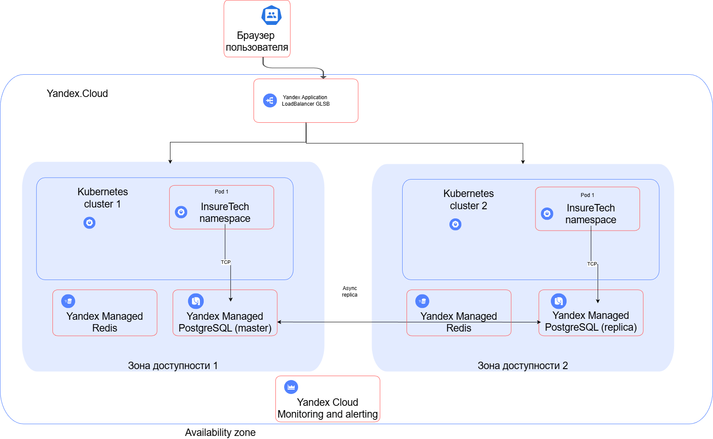

# Задание 1

## 1. Определите стратегию масштабирования и отказоустойчивости.

Основная задача, обеспечить плавную нагрузку для разных регионов.
Вертикальное масштабирование (повышение производительности одного кластера) не подходит.

Используем горизонтальное масштабирование.

## 2.a Проработайте конфигурацию развёртывания приложения в Kubernetes. 

Независимые kubernetes кластеры, распределённые в разных ЦОДах географически.
У единого кластера будут проблемы в синхронизации между разными ЦОД и отказоустойчивостью - будет сильно сложнее всё это организовать.

## 2.b. Спланируйте балансировку нагрузки

Используется балансировщик Yandex.
Умеет распределять трафик между дата-центрами географически, и в случае падения одного дата-центра автоматически переключит трафик на работающие.

## 2.c. Определите наиболее подходящую фейловер-стратегию.

Yandex Managed Postgres умеет в автоматический failover между зонами.
    Read-only реплики в других регионах
    Backup и PITR из любого региона

## 2.d. Определите конфигурацию базы данных. 

Yandex Managed Postgres:
    Автоматическая асинхронная репликация в разные availability zones
    Поддержка кросс-регион репликации
    Простое управление через консоль/API

    Автоматическое обновление и патчинг
    Мониторинг и алертинг
    Managed backups и maintenance

## 3. Определите, будете ли вы применять шардирование БД.

Размер БД очень скромный (50ГБ), так что шардирование не требуется.
Очень большая разница между запросами на чтение и записью в БД, поэтому лучше добавить кэш Redis, чтобы снизить нагрузку на БД на операции чтения.

# Диаграмма to_be

 