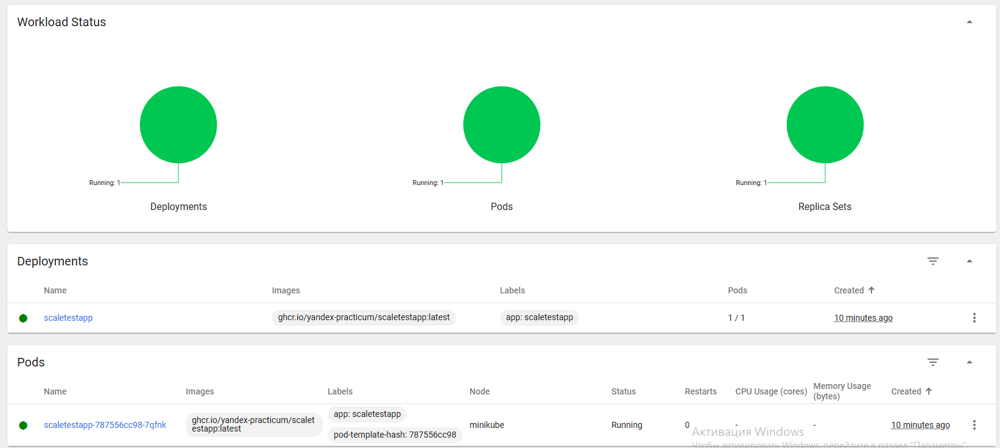
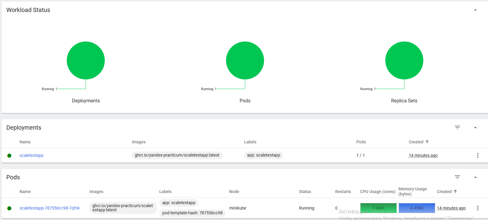
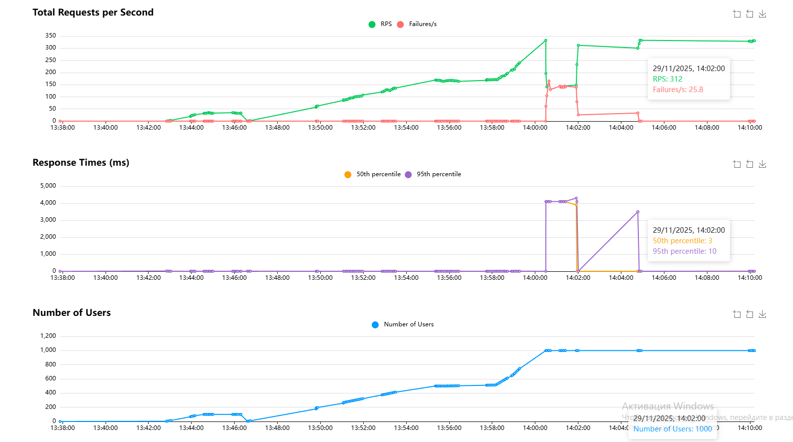
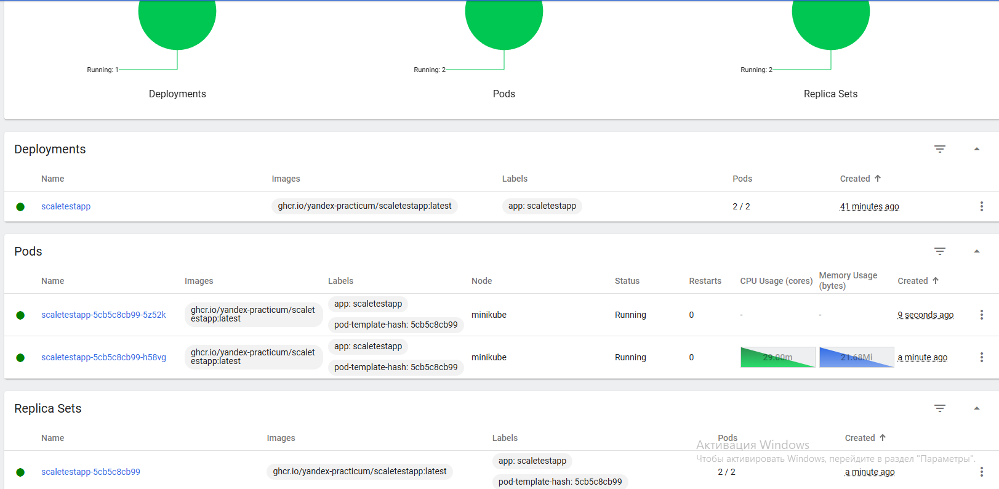

# Запускаем minikube

    minikube start

# Применяем конфигурацию

   kubectl apply -f deployment.yaml
   kubectl apply -f service.yaml
   kubectl apply -f hpa.yaml

# Проверяем, что поды поднялись, ждём пока не поднимутся
   kubectl get pods

# Пробрасываем под наружу

    kubectl port-forward svc/scaletestapp-service 8080:8080
    minikube service scaletestapp-service --url

# Добавляем в minikube метрики и открываем дашборд

minikube addons enable metrics-server 
minikube dashboard 

# Запуска locust и даём небольшую нагрузку (100 юезеров)

    locust 

Нагрузка незначительна, под в рамках лимитов.

 

# Увеличиваем нагрузку

 

 

# Итого

При достижении лимита в 24МБ (80% от 30МБ, согласно конфигу) под упал.

В кубернетесе сработал лимит на предел памяти для пода быстрее, чем Автоскейл.
Рекомендуется выставлять limits в 2-4 раза выше, чем requests.

Изменил limits до 120mi и при достижении 24МБ, запустился второй под (реплика, следом под).

resources:
            requests:
              memory: "30Mi"
            limits:
              memory: "120Mi"

