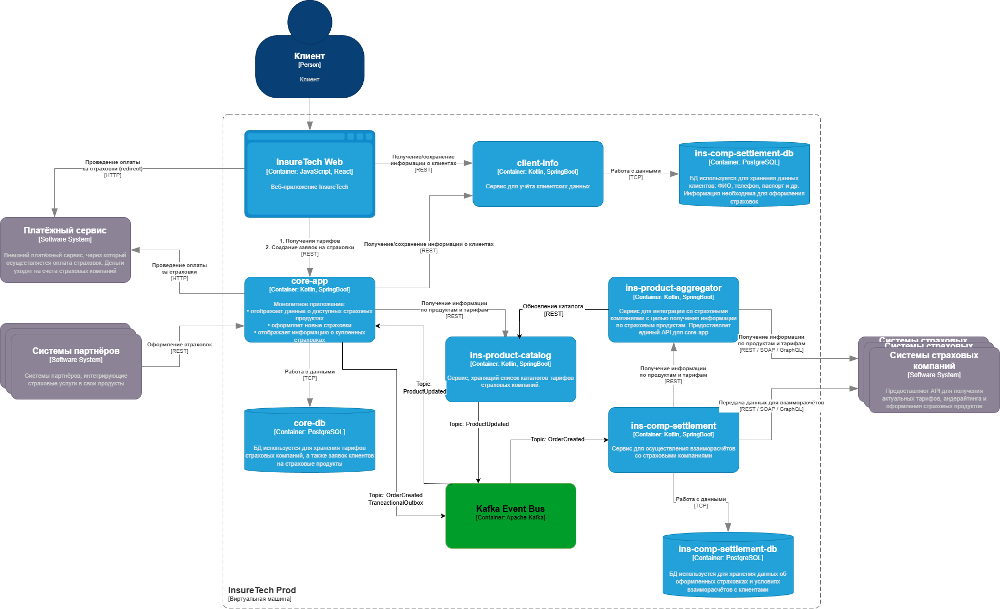

# Анализ текущей архитектуры
Проблемы, риски, решение.

## Проблемы

Сервис выполняет синхронные запросы ко всем API партнёров сразу сразу:
    Периодически API партнёров отвечают долго и это негативно сказывается на основной запрос
    Периодически возникают ошибки при обращении партнёров, что приводит к ошибкам запроса.

## Риски

Увеличение количества подключенных API замедлит синхронный запрос
Увеличится объём агрегируемых данных в одном запросе, что может критически сказаться на ресурсах (ЦПУ, Память, сеть)
Нагрузка на аггрегатор пиковая, а не равномерная
Обновление данных во внутренних сервисах происходит с разными интервалами, что может привести к неконсистентности данных.

## Решение

Использование Event-Driven подхода:
- ins-product-aggregator периодически опрашивает каждое API партнёра отдельно
- полученные данные отправляются в новый сервис ins-product-katalog
- ins-product-katalog ведёт список всех каталогов партнёров и обновляет данные, если они изменились
- при изменении, публикует событие в топик Kafka
- core-app и ins-comp-settlement может получить список всех каталогов из ins-product-catalog (например, при старте)
- core-app и ins-comp-settlement подписывается на топик в Kafka и при появлении события может обновить соответствующий локальный каталог 
- core-app при создании страховки пишет в одной транзакции в Outbox и потом отправляет все записи из Outbox в топик Kafka
- ins-comp-settlement подписывается на топик в Kafka со страховками и моментально получает информацию о новых страховках

# Диаграмма to_be

 