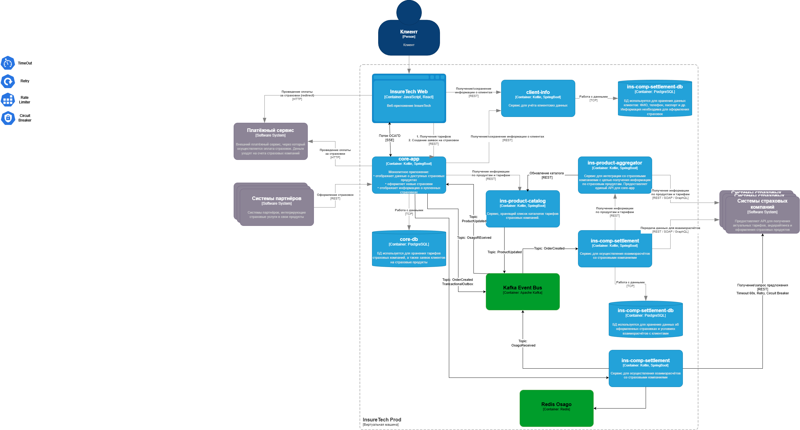

# Osago-integrator

1. Своё хранилище данных не требуется. Так как время хранения информации крайне мало. Можно выкладывать полученную информацию в Redis.
2. Для core-app предоставляет API для создания мультизаявки партнёрам.
3. Интеграция между core-app и osago делится на 2 части:
- API в osago для создания заявки
- Топик в Kafka куда будут публиковаться предложения от партнёров
4. Веб-приложение будет через SSE дожидаться предложений от партнёров из core-app
5. При обращении в API партнёров можно использовать Timeout в 60 секунд, так как в требованиях от бизнеса предельное время ожидания предложений 60с.
Retry при ошибке, Circuit Breaker - чтобы не тратить ресурсы на недоступные API.
6. Сервисы работают с одним топиком, поэтому кол-во экземпляров не важно. 

# Диаграмма to_be

 